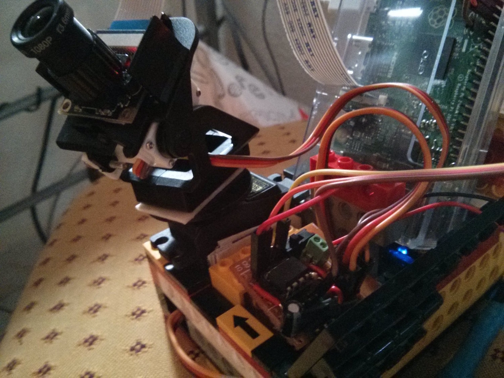
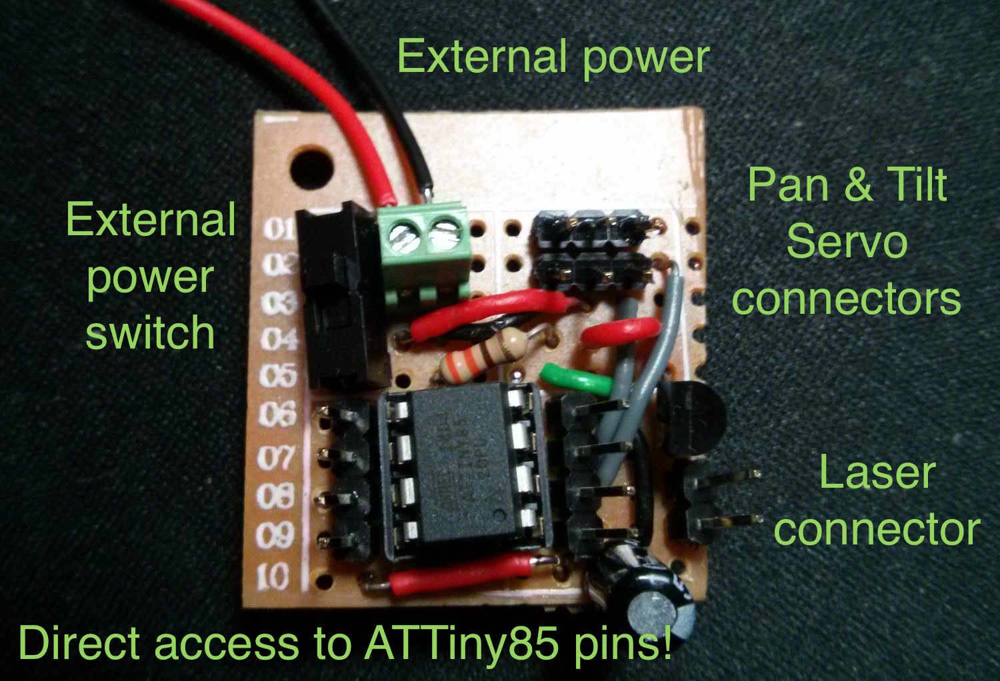
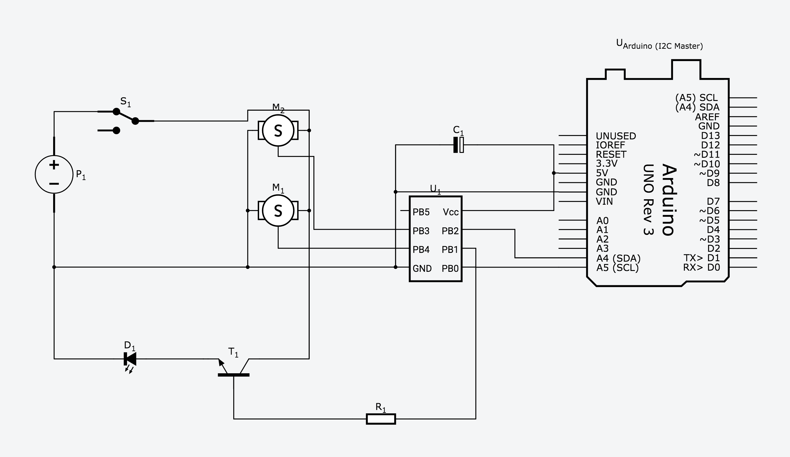

# PTTinyController
Control a PT platform from a Raspberry Pi 2 using an AT-Tiny85, 2 servos and I2C communication

This project is based on the excellent work from aboudou and his excellent [Tiny Laser Turret](https://github.com/aboudou/tinylaserturret) project. But while his goal is to have fun with cats (which is a noble goal), mine is to remotely control a camera.

Using a Sainsmart NoIR camera attached to a raspberry pi 2, I needed to control the pan and tilt, as well as the infrared lighting, which needs to be powered externally. On a setup with a regular camera, you could replace the lighting by a laser... and scare cats!

You may ask why I don't control the servos directly from the RPi:
- I tried, but generating a software PWM signal while the CPU is busy with streaming the video is not good enough.
- Where is the fun? I could have tried to work around the initial PWM problem with some other software options, or use a control board, but this is a good occasion to play with the ATTiny85, as it is a bit challenging!

In order for the raspberry to control the pan/tilt/lighting, I used TinyWireS library to implement an I2C slave interface.

As of today, I have already built a small setup, with LEGOs and a small poorly soldered chip. I validated that the laser can be controlled, but neither mounted it, nor tried to mount the IR lighting. The result is pretty good, as I can stream with RTSP the video and control remotely the pan/tilt!

And here is the ugly monster! You don't want to see the other side :-)

## Requirements
- An ATtiny85 microcontroller, with 8MHz internal clock
- A BCU-81 transistor or equivalent to drive the optional module (laser, IR lighting)
- A 330Ω resistor to drive BCU-81 transistor.
- A pan & tilt platform with servos to orient the camera. Can be build with a 3D printer or bought online.
- An external power supply for servos and optional module (assumed regulated)

This is it! While the attiny85 will be powered and controlled by the raspberry, you still need an external 5V power supply to power up your payload.

## Current schematics

Very rough representation of the current wiring. The LED represents the optional payload (laser, or IR lighting). Remember that you need to use a 5V regulated power source!

## TODOS
This project is not terminated. Please do not hesitate to provide comments and suggestions!

Remaining things:
- Properly documenting everything
- Checking that every lib used is properly referenced, and probably a thanks page!
- Try replacing SoftwareServo by an interrupt-based lib
- Have a PCB made for that setup! This is currently not the right time as I may need to add a few things, but I would really love to make one!
- While the tilt is probably fine with a [-90:+90] range, the ultimate goal would be to have a full 360 degrees continuous rotation! But it raises several problems, as having a fine control on the exact pan position, using a slip ring for powering the platform, and also building the platform itself, with proper motorisation!
- The camera control and raspberry install will be part of another repo. Currently I simply stream with [raspivid and cvlc](https://gist.github.com/RouquinBlanc/c4924fa9bef5f10377e2), and use i2c-tools to send the PT commands. Obviously it would be nice to have something nicer!

[To be continued]
